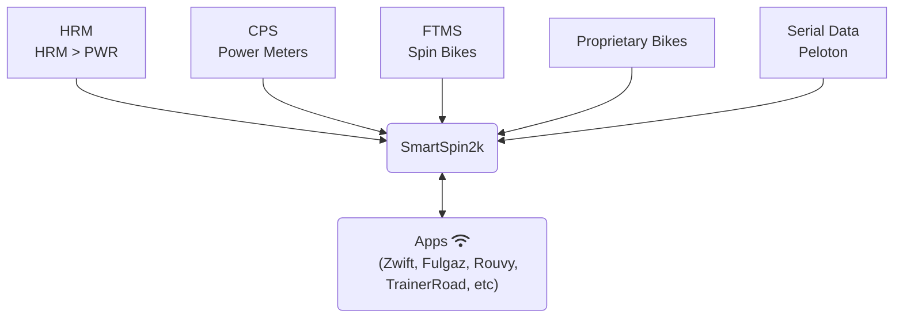

# Background
I travel for a living and some hotels I stay at have spin bikes. I started carrying my own power meter pedals for the spin bikes so I could ride Zwift, but the experience just isn't the same without automatic resistance on the hills. Then one day I was looking down at that simple to turn knob and I had a thought - With the power meter pedals attached, almost everything is already in place on this $300 spin bike to turn it into the equivalent of a $3,000 computer controlled smart bike! And so here we are....

Thanks to some user requests, HR based power using an algorithm based on this page from Brian Mac is currently being tested. While no substitute for a true power meter (pedals or crank based) this provides very general average power information and is usable for steady state efforts.

# Introduction to the SmartSpin2k
SmartSpin2k is an open source project that uses an ESP32 and stepper motor to let fitness apps like Zwift automatically control spin bikes that have a resistance knob. The SmartSpin2k also has shifter buttons that allow the user to simulate shifting gears on the stationary bike.

 Videos of SmartSpin2k

> 
> 

# Summary of Function

Your power meter or spin bike sends cycling power and cadence to Zwift (or any other cycling app). SmartSpin2k then connects to the APP as a controllable trainer via bluetooth. The APP is able to request SmartSpin2k to increase or decrease the amount of resistance on your bike and SS2K will then change the resistance accordingly. If you choose to pair your power source directly to SmartSpin2k, ERG mode is also available which lets an app directly control your watt output regardless of your cadence. In addition to adjusting the knob, SmartSpin2k also has shifter buttons to simulate virtual shifting. 

Configuration is accomplished via a web interface hosted by the SmartSpin2k. If you connect the unit to WiFi with an internet connection, it will also perform automatic software updates whenever they become available! 

