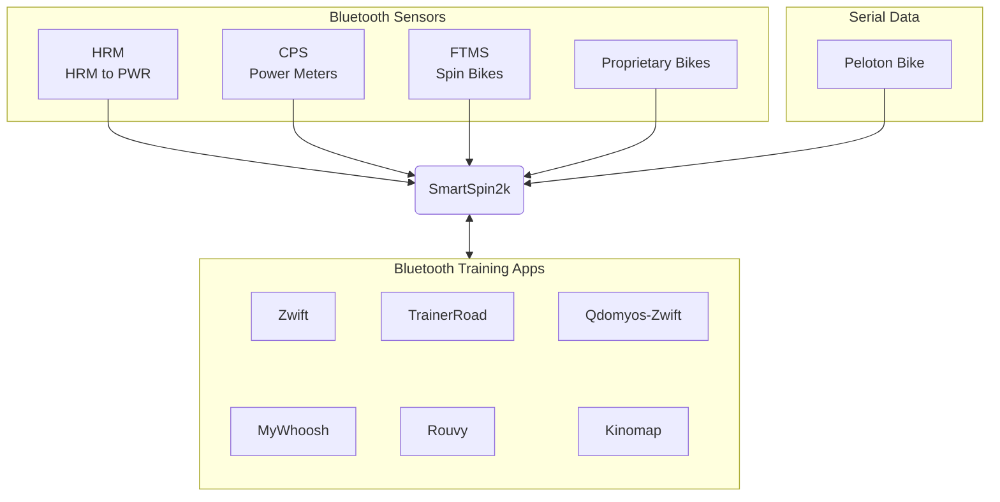

# About SmartSpin2k
## Background
As a person whose job requires a substantial amount of traveling, I find myself using hotel spin bikes often. Initially, I started carrying my own power meter pedals for use on the hotel spin bikes so I could ride Zwift. This was an improvement, but it still wasn't giving me the full experience that I wanted...the experience of automatic resistance on the hills. Was this a luxury I just had to live without on the road? One day as I was using a hotel spin bike, I glanced down at the simple-to-turn knob, and my wheels of imagination started turning. With my power meter pedals attached, almost everything was already in place on this \\$300 spin bike, except for one important component...a device to control the resistance knob! I love a good challenge, and I love creating and inventing. And so naturally, this was the beginning of a whole lot of brainstorming for me, and eventually the start of this genius little creation that became known as SmartSpin2k. So to answer my previous question, was automatic resistance a luxury I had to live without on the road? Absolutely not anymore! And even more exciting, I had just found a way to turn a \\$300 spin bike into the equivalent of a \\$3,000 computer-controlled smart bike!

Thanks to some user requests, HR-based power using an algorithm based on this page from Brian Mac is currently being tested. While no substitute for a true power meter (pedals or crank based), it provides very general average power information and is usable for steady state efforts.

## Introduction to the SmartSpin2k
SmartSpin2k is an open-source project that uses an ESP32 and stepper motor to let fitness apps like Zwift automatically control spin bikes that have a resistance knob. The SmartSpin2k also has shifter buttons that allow the user to simulate shifting gears on the stationary bike.

 Videos of SmartSpin2k

> 
> 

## Summary of Function

Your power meter or spin bike sends cycling power and cadence to Zwift (or any other cycling app). SmartSpin2k then connects to the app as a controllable trainer via Bluetooth. The app is able to request SmartSpin2k to increase or decrease the amount of resistance on your bike and SmartSpin2k will then change the resistance accordingly. If you choose to pair your power source directly to SmartSpin2k, ERG mode is also available, which lets an app directly control your watt output regardless of your cadence. In addition to adjusting the knob, SmartSpin2k also has shifter buttons to simulate virtual shifting. 

Configuration is accomplished via a web interface hosted by the SmartSpin2k. If you connect the unit to Wi-Fi with an internet connection, it will also perform automatic software updates whenever they become available! 

