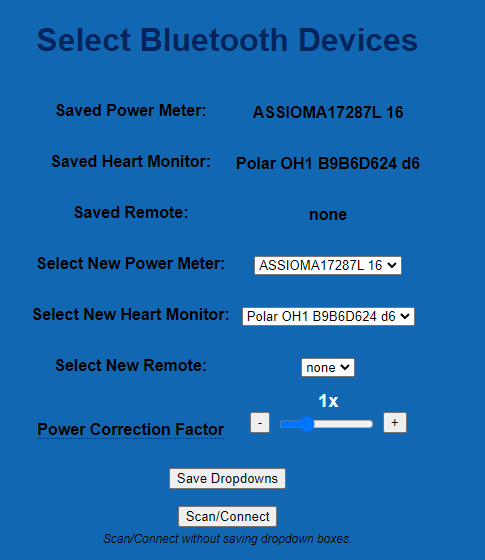

# Bluetooth Pairing Guide
{: .no_toc }

Table of contents
{: .no_toc }
{: .text-delta }
- TOC
{:toc}
---

## How Do I Connect My Sensors to the SmartSpin2k?
OK, your SmartSpin2k is connected, and the blue LED is slowly flashing, ready for you to provide some Bluetooth connections, and you’re ready to ride! SmartSpin2k will act as a Bluetooth multiplexer and serve all of your connections.  This means it operates as a single point for your sensors to connect to.  You can then pair your device to the SmartSpin2k as a single sensor.  This is helpful for devices like the Apple TV, which are limited to just two connections at a time.

## Pairing Bluetooth Sensors Automatically
* Ensure all third-party apps that may be connected to your bike or power meter are turned off.
* Turn on your bike or power meter.
* Turn on the SmartSpin2k.  It will automatically connect to your bike or power meter.
* Launch your training app and pair it to SmartSpin2k ([Zwift example here](../getting-started/first-ride#pair-smartspin2k-to-your-training-app)).
* Start riding!

## Pairing Bluetooth Sensors Manually
If you own a power meter, and use it on a Bluetooth-enabled bike like the Schwinn IC4, you'll want to manually select it. This is also useful if you have multiple power meters or bikes nearby.

* From http://smartspin2k.local, click Bluetooth Scanner.
 

 
* Make sure you're wearing your HR sensor and that it's not paired via Bluetooth to any other devices like a Garmin watch or iPad/iPhone.
* Have your Bluetooth power pedals charged or with batteries and ready to pair. Also, make sure they are not connected to any other devices as mentioned in the previous step.
* Click Scan/Connect.
* Select the HR monitor in the Select New Heart Monitor drop-down box.
* Select the power meter in the Select New Power Meter drop-down box.  Users with a dedicated power meter and a bike that reports power data must select the appropriate power meter here.  Leaving this setting at "any" may cause SmartSpin2k to receive power data from both sources and cause unintended fluctuations in reported data.
* Click Save Dropdowns.
* Leave Select New Remote as "none".

## Reconnect Bluetooth During Your Ride
In case you experience a Bluetooth drop, you can force SmartSpin2k to rescan Bluetooth with the shifter at any time during your ride.

* Press and hold both buttons on the shifter for 3 seconds.
* Release.
* SmartSpin2k should rescan and reconnect your bike/sensors.