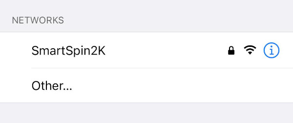

# Advanced Configuration
{: .no_toc }

You can access the advanced configuration settings of your SmartSpin2k either using the SmartSpin2k Companion App or using wifi.  _We recommend the app for most users_.

Through advanced configuration, you can do things like specify your power meter increasing your shift steps, flip the shifter button orientation, and much more.  Learn more about the different settings [here](#what-do-all-these-settings-mean)

Table of contents
{: .no_toc }
{: .text-delta }
- TOC
{:toc}
---

## Using the SmartSpin2k Companion App
<iframe width="560" height="315" src="https://www.youtube.com/embed/qgieNuQlTp8?si=dkuHuU5kF_VBW8Wf&amp;clip=UgkxNvc7uFBptHiztHKbLOWX6chsJzNLmIeM&amp;clipt=ENy0AxjI1gU" title="YouTube video player" frameborder="0" allow="accelerometer; autoplay; clipboard-write; encrypted-media; gyroscope; picture-in-picture; web-share" referrerpolicy="strict-origin-when-cross-origin" allowfullscreen></iframe>

1. Install the SmartSpin2k Companion App
    * [IOS](https://apps.apple.com/us/app/smartspin2k-companion-app/id6477836948)
    * Android: Coming to the play store soon!  Download the app on [Github](https://github.com/doudar/SS2kConfigApp/releases/tag/1.0.0)
1. Launch the App
1. Click "Scan"
1. Click Connect on your SmartSpin2K
1. You can now configure your device.  [Click here to learn more](#what-do-all-these-settings-mean) about the different settings.

## Configure Wi-Fi

Expand to view mobile app pairing instructions

1. On initial boot, the SmartSpin2k will create its own Wi-Fi network access point with the SSID of “SmartSpin2k”.  If asked for a password, use "password" without the quotes. 
    
1. The configuration page will automatically load on mobile. If you are not taken to the page or if you are using a computer, the configuration page can be found at <http://SmartSpin2k.local/>. 
    
1. Enter your local Wi-Fi network information with SSID and password. Please note:  The SmartSpin2k requires a 2.4ghz Wi-Fi connection.  Please ensure you use the correct Wi-Fi network if you have separate SSIDs for 5ghz and 2.4ghz.
1. Click Submit and wait for the page to refresh.
1. Click Reboot.
1. SmartSpin2k will automatically update if the Wi-Fi network you paired the device to is connected to the internet.  The blue LED will flash quickly while this process occurs.  **This may take up to 3 minutes.**  
1. Once the blue LED is flashing slowly, make sure your phone or computer are connected to your home Wi-Fi network.
1. Navigate to <http://SmartSpin2k.local/> to confirm that you can access the configuration pages of SmartSpin2k.  You should see a page like this:  
    
1. You can now configure your device.  [Click here to learn more](#what-do-all-these-settings-mean) about the different settings.

## What Do All These Settings Mean?
There are a number of settings available to customize the behavior of your SmartSpin2k to optimize the feel and realism with your Zwift ride. These settings will vary from bike to bike. 

You can adjust these settings mid ride from your browser while you're getting it dialed in.

We have a much more in-depth walk through of the SmartSpin2k Companion App and all of the settings described below on [YouTube](https://www.youtube.com/watch?v=qgieNuQlTp8)

| Setting Name (App)     | Setting Name (Web)          | Description                                                                                                                                                                                                                                                                                                                                                                                                                                                                                                                                                                                                                                                                                                                 |
| ---------------------- | --------------------------- | --------------------------------------------------------------------------------------------------------------------------------------------------------------------------------------------------------------------------------------------------------------------------------------------------------------------------------------------------------------------------------------------------------------------------------------------------------------------------------------------------------------------------------------------------------------------------------------------------------------------------------------------------------------------------------------------------------------------------- |
| Shift Step             | SIM Mode Shift Amount       | This setting controls how much each click of the shifter turns the dial. The ideal setting is different for each bike and person. Try aiming for a +/- 30 watt change when you click the shifter. Higher values will turn the knob further.|
| Incline Multiplier     | SIM Mode Incline Multiplier | This setting affects how much you will feel the impact of hills in SIM mode rides. The value is adjustable from 1 to 10. Pick the setting which feels most realistic to you. Higher values will make hills feel steeper, while lower values will flatten out the hills. Try starting at 5 and going up and down from there. Please note that Zwift has a default hill difficulty of 50%. This cuts the impact of the SIM Mode Incline Multiplier in half. For realistic results, you may need to adjust this setting in the app. [Read more about Zwift Difficulty here.]([https://zwiftinsider.com/using-the-trainer-difficulty-setting-in-zwift/](https://zwiftinsider.com/using-the-trainer-difficulty-setting-in-zwift/)) |
| ERG Sensitivity        | ERG Mode Sensitivity        | This setting adjusts the aggressiveness of the ERG. This can be adjusted from 1 to 20. Too low will cause the ERG to be slow at reaching the target wattage. Too high will cause it to overshoot too far and miss the target in each direction before it settles. A good starting value is 5. A little bit of overshoot is okay if it settles on the target output quickly. |
| Min Brake Watts        | Min Bike Brake Watts        | This setting is the lower limit of watts your bike can absorb. This is set to ensure that the SmartSpin2k does not try to turn the knob below its minimum limit. Too low will crash the knob at the lowest setting your bike can achieve and will cause problems later during your ride. You can determine this value by pedaling at 90 rpm with the resistance somewhere above absolute zero on the knob. A good starting point is usually 1-2 turns from the lowest resistance. On the Schwinn IC4, it's suggested to have the resistance at 10 (out of 100) for this test. Take note of the watts at this resistance and cadence. This is your minimum brake watts value. |
| Max Brake Watts        | Max Bike Brake Watts        | This setting is the upper limit of watts your bike can absorb. This is set to ensure that the SmartSpin2k does not try to turn the knob past its maximum limit. This value will vary per bike, and some riders will not be able to achieve the maximum value their bike can support. A good setting to start with is 700-800 watts. You can determine this value by pedaling at 90 rpm with the resistance as high as you can comfortably hold it and take note of the watts. Depending on how close you are to the bike's maximum resistance, you can set this value higher, or close to, this number. |
| Stepper Power           | Stepper Power               | Adjust this setting if you are experiencing overheat issues or if you need additional torque for a felt-resistance bike. Do not exceed your power supply's rated limits. |
| StealthChop            | Stepper StealthChop         | This silences the stepper motor. Leave it on unless it's causing issues. Turning it off may provide some additional torque if you have a felt-resistance bike. |
| N/A                    | Stepper Motor Direction     | This setting controls the orientation of the motor and the direction it turns. Depending on how your motor is wired, this may need to be toggled. |
| Swap Shifter Direction | Shifter Direction           | This setting controls which shifter button is up and which is down. Toggle this if you need to invert the direction of the shifters. |
| N/A                    | Enable UDP Logging          | Leave this off unless you need access to logs from SS2k on your computer. Instructions for accessing the UDP logs can be found [here.]([https://github.com/doudar/SmartSpin2k/wiki/Viewing-logs-via-UDP](https://github.com/doudar/SmartSpin2k/wiki/Viewing-logs-via-UDP))  |