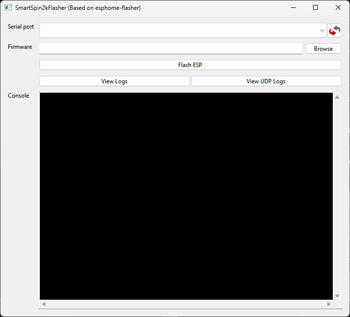
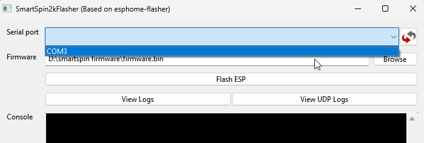
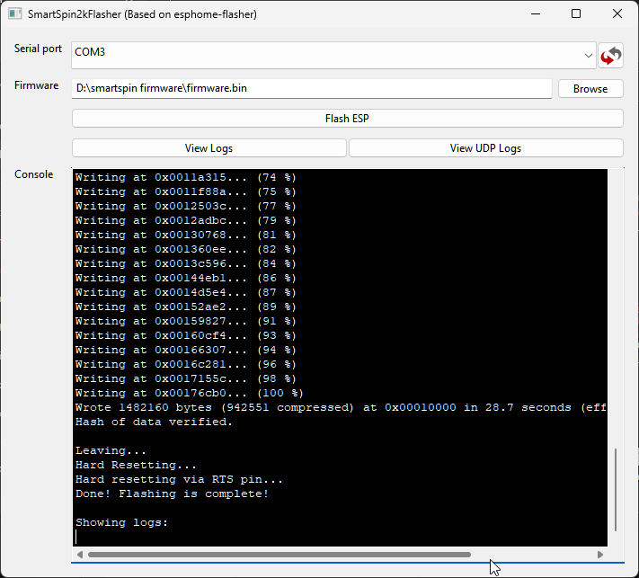

# SmartSpin2k Firmware
{: .no_toc }

Table of contents
{: .no_toc }
{: .text-delta }
- TOC
{:toc}
---
## Update existing firmware using Companion App

{: .caution }
Users with older firmwares prior to February 2024 will need to update to the latest using the Wi-Fi or USB flashing instructions before the app can be used.

1. In the SmartSpin2k Config App, select Update Firmware.
2. Select the firmware option you would like to install.  
3. Installation may take a few minutes.
4. Installations can occasionally fail partway through. If this happens, reboot your SmartSpin2k before trying to upload again.

## Update existing firmware using Wi-Fi
1. Download the latest [SmartSpin2K firmware](https://github.com/doudar/SmartSpin2k/releases/) and extract the zip file.
3. Access http://smartspin2k.local on your browser
4. Select Update Firmware
5. For both Username and Password, enter "admin"
6. Choose firmware.bin (ensure the filename exactly matches this)
7. Click Update
8. Once updating is complete (the progress bar shows 100%), the SS2k will automatically reboot.
9. You can then check the installed firmware version at the bottom of http://smartspin2k.local/index.html

## Flash over USB
Before you start, be sure you have:
* Micro USB cable
* [CP210x VCP drivers](https://www.silabs.com/products/development-tools/software/usb-to-uart-bridge-vcp-drivers).
* [SmartSpin2K Flasher](https://github.com/SmartSpin2K/SmartSpin2kFlasher/releases/)
* [The latest SmartSpin2K firmware](https://github.com/doudar/SmartSpin2k/releases/).

1. Connect a Micro USB cable to your computer and your SmartSpin2K (You do not need the power cable for this)
2. Start SmartSpin2KFlasher.exe  
    

3. Click the serial port  dropdown and select your SmartSpin2K - it will appear as COM# (the number may vary)  
    

5. Click Browse and find your firmware.bin file from above

6. Click Flash ESP

7. The ESP32 Microcontroller will be flashed with the firmware and the logger will immediately start showing data if flashing was successful:  
    

{: .caution }
**V2 Owners** may need to press the boot button when plugging in the usb  cable in order to enter into bootloader mode.  

## Flash using IDE
1. Install Microsoft Visual Code. https://code.visualstudio.com/
2. Install PlatformIO into Visual Code. https://platformio.org/platformio-ide
3. Open this project in PlatformIO.  
4. Compile the project and upload to an ESP32

## Still having difficulty?
For users that are having difficulty upgrading to the latest firmware via the normal methods, this is an in-depth instructional video to help guide you through the process.

