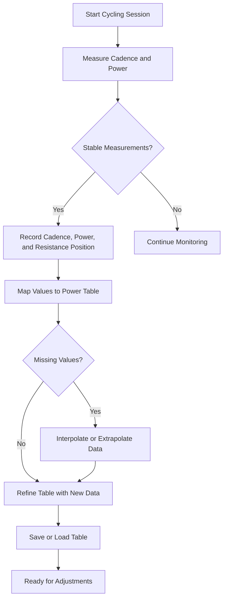
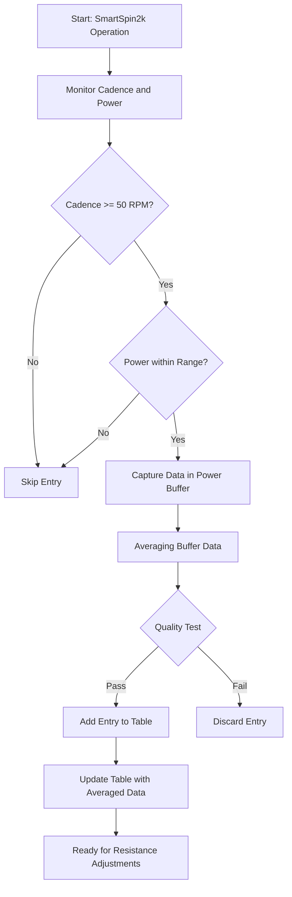
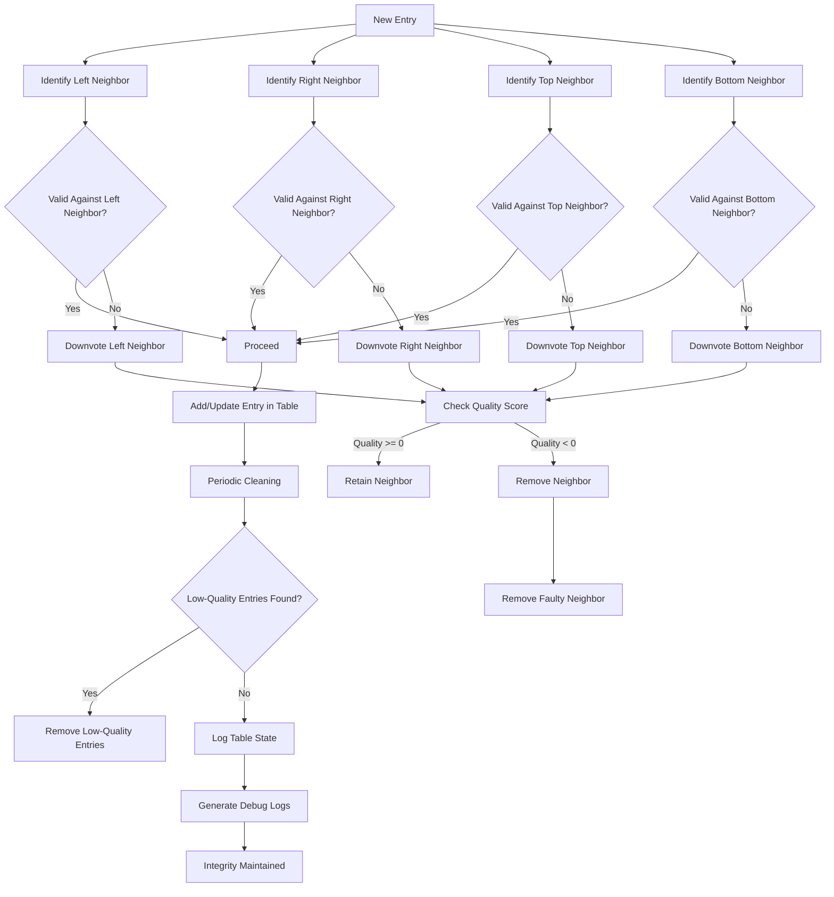
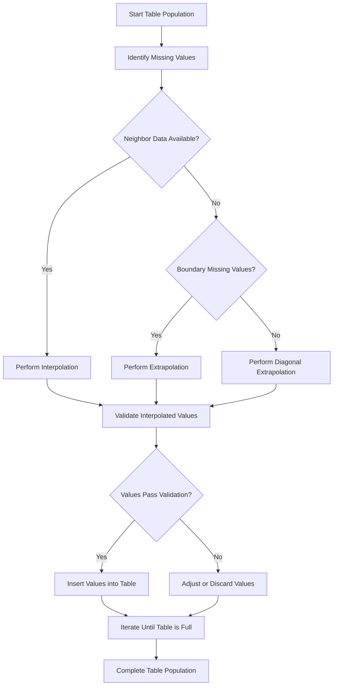
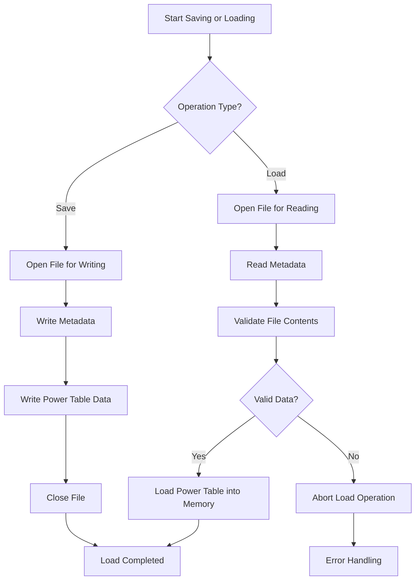

# Documentation: Power Table Generation in SmartSpin2k
{: .no_toc }

Table of contents
{: .no_toc }
{: .text-delta }
- TOC
{:toc}
---

## 1. Introduction to the SmartSpin2k Power Table
  
The power table in the SmartSpin2k system simplifies resistance adjustments, making workouts smoother and more consistent. It works by predicting the stepper motor positions needed for different speeds (RPM) and power levels (watts). By doing this in advance, the system responds quickly and accurately during exercise, improving performance without delays.

### How It Works (high level)
  
Picture riding a stationary bike where pedaling faster (higher cadence) or applying more effort (higher power) prompts the system to adjust resistance, keeping your workout engaging. The SmartSpin2k uses a power table to predict and preset these resistance adjustments.  
  
Here's how the process works:  
  
1. As you ride, the system continuously measures your cadence and power.
2. When stable measurements are detected, the system records these values along with the resistance position.
3. These measurements are mapped to a table, filling in specific entries for different cadence and power combinations.
4. The table is refined over time, using neighboring values to fill in missing data points and ensure smooth transitions.
5. The system can save or load this table, making it reusable across sessions.  
  
This approach ensures that when you suddenly pedal harder or slower, the system already knows how to adjust the resistance without delay by referencing precomputed stepper motor positions in the power table. These precomputed values allow for instant lookups, eliminating the lag associated with real-time calculations.

---

## 2. Power Table Generation Process
  
The power table is dynamically generated during SmartSpin2k operation to minimize latency when adjusting resistance by precomputing stepper motor positions for a range of cadence and power values. This reduces the time spent seeking target resistance levels during sudden changes, ensuring smoother operation. This chart details the process of generating and managing the power table.  
  

  
---

## 3. Validation and Quality Control
  
The validation and quality control mechanisms ensure that the power table remains logically consistent and reflects accurate data. These processes maintain the reliability of the table by enforcing strict tests and corrective actions when data conflicts are detected.  

---

## 4. Table Population
  
Table population in the SmartSpin2k system is responsible for filling in missing values in the power table to create a comprehensive data set. This ensures seamless operation by leveraging interpolation and extrapolation techniques to estimate unknown entries based on available data.  
  

	    
---

## 5. Saving and Loading the Power Table
  
Saving and loading the power table is crucial for preserving the calibration and performance data of the SmartSpin2k system. This process allows users to retain and reuse power tables across sessions and devices, ensuring consistent performance without repeated recalibration.  
  

