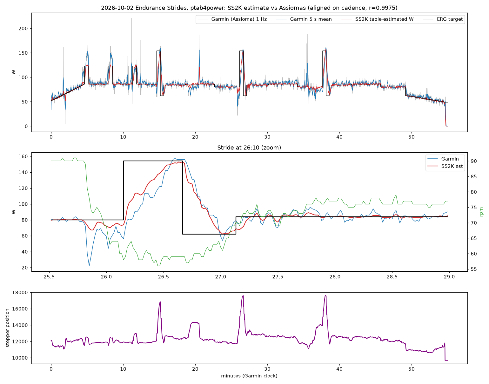

# Power from the Power Table
{: .no_toc }

  

    
Advanced

    <h2 class="gs-hero__title" id="what-it-does">Power without a power meter on the bike</h2>
    
SmartSpin2k can work out your power from where the knob is and how fast you're pedaling. It looks both up in a Power Table that was learned with a power meter on your bike, and sends the result to your training app as your power.

    
The setting is called <strong>PowerTable For Power</strong>, often shortened to PTab4Power.

  

{: .red }
**You need a power meter, or a Power Table someone made with a power meter on your bike model.** The table is learned from real power readings. A table from a different bike or model will give wrong power and ERG mode that feels off, because each bike turns knob position into resistance differently.

Table of contents
{: .no_toc }
{: .text-delta }
- TOC
{:toc}

## How it works

  
<strong>Knob position</strong>where SmartSpin2k has turned the knob

  
+

  
<strong>Cadence</strong>from your bike, sensor, or pedals

  
→

  
<strong>Power Table</strong>learned with a power meter

  
→

  
<strong>Watts</strong>sent to your training app

While you ride with a power meter, SmartSpin2k records where the knob was at each cadence and power. That record is the Power Table. Rows are cadence, from 60 to 105 rpm in 5 rpm steps. Columns are power, in 30 W steps. Each cell holds a knob position.

Normally ERG mode uses the table to jump straight to the right resistance for a target. PowerTable For Power reads it the other way round: from the knob position and your cadence, it finds the power.

<table>
<thead><tr><th>Cadence</th><th>60 W</th><th>90 W</th><th>120 W</th><th>150 W</th></tr></thead>
<tbody>
<tr><th>70 rpm</th><td>1233</td><td>1377</td><td class="pt-grid__empty">–</td><td class="pt-grid__empty">–</td></tr>
<tr><th>75 rpm</th><td>1171</td><td>1314</td><td>1427</td><td class="pt-grid__empty">–</td></tr>
<tr><th>80 rpm</th><td>1150</td><td class="pt-grid__hit">1280</td><td>1389</td><td class="pt-grid__empty">–</td></tr>
<tr><th>85 rpm</th><td>1115</td><td>1244</td><td>1339</td><td class="pt-grid__empty">–</td></tr>
<tr><th>90 rpm</th><td>1087</td><td>1210</td><td>1289</td><td class="pt-grid__empty">–</td></tr>
</tbody>
</table>

Part of a real table after one ride. With the knob at 1280 and you pedaling at 80 rpm, SmartSpin2k reports about 90 W. Positions in between are worked out from the neighbours. Empty cells (–) haven't been learned yet, so power there is a guess.

You can see your own table in the Companion App on the **Device** screen under **Power Table**. Example tables and a viewer are on [smartspin2k.com/powertables](https://smartspin2k.com/powertables).

## Is it for you?

A good fit

- Your bike has no power output, or its power reading is poor.
- You can borrow or share a power meter for a few rides to build a table, then ride without it.
- Someone has shared a table for your exact bike model that they built with a power meter.

Not a good fit

- You have no power meter and no table for your bike model. There's nothing to learn from.
- You'd use a table from a different bike or model.
- You already ride with a power meter. Measured power is always better.
- You race, or need power that matches a real meter closely.

### Which tables can you use?

✅ Learned on your bike

Built by riding your own bike with a power meter. This is the best case. It matches your bike, your mount, and your calibration.

⚠️ Same bike model, made with a power meter

A usable starting point. Bikes of the same model differ a little, and so do mounts. Expect some error, and check it against a power meter if you can.

❌ A different bike or model

Don't use it. Resistance builds differently from bike to bike, so both the power and the ERG feel will be wrong.

## Turn it on

You'll need three things first:

- **Calibration.** Knob positions only mean something once SmartSpin2k knows where zero is. See [Calibration]().
- **A Power Table for your bike.** If you don't have one yet, see [Get a Power Table](#get-a-power-table).
- **A cadence source.** Your bike, a cadence sensor, or power meter pedals. Power is looked up from cadence, so SmartSpin2k needs it on every ride.







If a power meter is still paired, SmartSpin2k ignores its power and uses the table. It still uses the meter's cadence.

**Check it once if you can.** On your first ride, record a power meter on a separate device, such as a bike computer, and compare the two afterwards. See [How close is it?](#how-close-is-it) for what to expect.

**To turn it off,** switch **PowerTable For Power** off on the same page. SmartSpin2k goes back to measured power, and the table starts learning again.

## Get a Power Table




This is the best way to get a table. You only need the power meter until the table is filled in.

1. [Calibrate]() first. Calibration clears the table.
2. Leave **PowerTable For Power** off.
3. Pair your power meter as the **Saved Power Meter**.
4. Ride. SmartSpin2k learns on its own. There's nothing to start.
5. Check the **Power Table** screen in the Companion App after each ride to see what has filled in.

SmartSpin2k only saves a reading when your riding is steady. It waits about 2 seconds after the knob moves, then needs a few seconds where the knob stays put, cadence stays within about 3 rpm, and power stays within about 20 W or 15%. A cell needs more than one reading before it's used, and a cadence row needs two used cells.

Cover your cadences

Spend steady time low, middle, and high, for example 65, 80, and 95 rpm. Rows you never ride stay empty.

Cover your power

Include easy, endurance, and harder efforts. ERG workouts with steps at several levels work well.

Hold steady

Long, even efforts teach the table more than surges and sprints. Several rides beat one.

The table saves every few minutes and is kept between rides once you've calibrated.

{: .highlight }
If your power meter reads high or low, fix that before you build the table. The **Power Multiplier** setting is applied while the table learns, so its correction ends up in every estimate.




Only use a table that was built with a power meter on the **same bike model**. See [Which tables can you use?](#which-tables-can-you-use)

1. [Calibrate]() first. Calibration clears the table.
2. Get a `.ptab` file for your model. Example tables are on [smartspin2k.com/powertables](https://smartspin2k.com/powertables).
3. Load it with the **Power Table** screen in the Companion App.

Even a table for your model is a starting point, not a perfect match. If you can borrow a power meter later, ride with **PowerTable For Power** off for a few rides. SmartSpin2k updates the table to fit your bike.




## How close is it?

Inside the area the table covers, it can be close. On a 55 minute ERG workout, a rider compared SmartSpin2k's estimate with Assioma power meter pedals recorded on a separate head unit. The table came from one earlier ride on the same bike and only covered 60–95 rpm and 60–120 W.

1.6%

average difference in steady riding inside the table (1.4 W)

92%

of steady riding within 5 W of the pedals

151–155 W

held on 154 W efforts at 60 rpm (pedals: 152–157 W)

15–20% low

at 100 rpm and above, outside the table

The red line is SmartSpin2k's estimate. The blue line is the pedals. Over the whole ride the two track closely. The estimate is much smoother, and the gaps open up where the rider went outside the area the table covered.

## Caveats

### The estimate is only as good as the table

Gaps become errors

Outside the cadences and power you've recorded, SmartSpin2k extends the nearest readings in a straight line. That can be close or well off.

No learning while it's on

The table is frozen. To fill gaps or update it, turn the setting off and ride with a power meter again.

Tied to your bike and mount

Positions are measured from where SmartSpin2k homes. Move or remount it, change the knob insert, or change **Stepper Motor Direction**, and the table no longer fits. Calibrate again and rebuild it.

Blind to changes in the bike

A warm flywheel, a worn belt, or bedded-in pads change the real power at a given knob position. Refresh the table now and then.

### It looks different from a real power meter

Smoother

The estimate comes from knob position and cadence, then gets averaged, so there are no pedal-stroke spikes.

Follows cadence instantly

Speed up or slow down and the number changes at once. A real meter can lag by a few seconds.

Big ERG steps settle slowly

A big jump, such as 80 W to 150 W, can take around 20 seconds to settle in this mode. Smaller changes settle quickly.

### When it shows 0 W

- SmartSpin2k hasn't homed yet this session. Pedal for a couple of seconds so it can.
- There's no table, or no cadence row has enough readings to use.
- You aren't pedaling, or no cadence is coming in.

If homing fails, SmartSpin2k turns the setting off for that session. With a power meter paired, you get measured power. The setting stays saved and it tries again on the next power-on.

### Other settings

- **Power Multiplier** affects the table while it learns, not the estimate.
- **Min Brake Watts** and **Max Brake Watts** limit ERG targets. They don't limit the estimate.
- **Clear Active Table** in the Companion App (**Power Table**, then **Table tools**) deletes the table and the calibration. You'll need to calibrate and get a new table.
