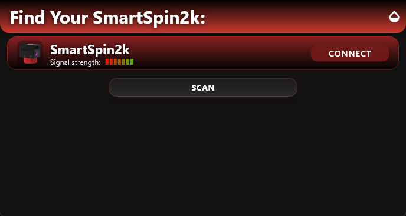
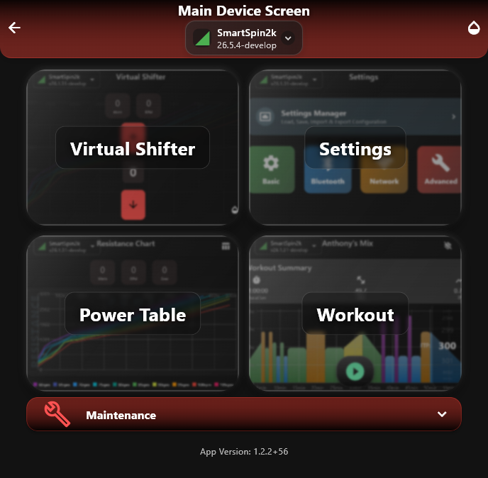
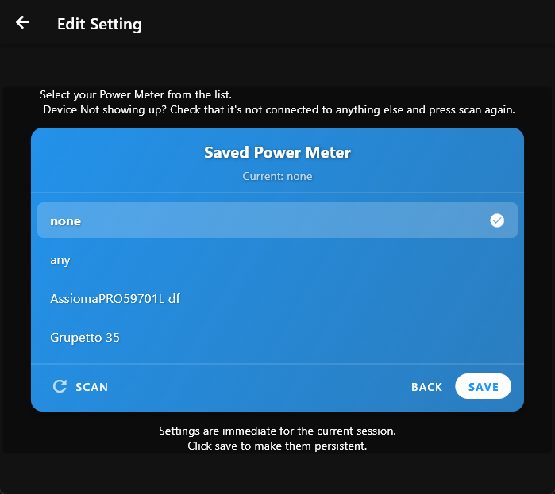
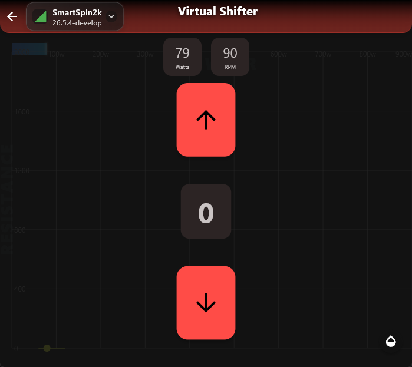

# Peloton Bike+ Setup
{: .no_toc }

The Bike+ has no wired connection to SmartSpin2k, so you'll get power and cadence data wirelessly. You have two options: install Grupetto (a free app) on the bike's tablet, or use a Bluetooth power meter. Pick whichever fits — the rest of setup is the same either way.

Table of contents
{: .no_toc }
{: .text-delta }
- TOC
{:toc}
---

## Before you start

- Hardware installed and SmartSpin2k powered on — if not, [start with installation](installation).
- Your phone with the SmartSpin2k Companion App.
- Either: the Bike+ tablet (for Grupetto), OR a Bluetooth power meter installed on the bike.

---

## Step 1: Pick your data source

The Bike+ doesn't broadcast power and cadence on its own. You'll need one of these to get that data flowing over Bluetooth:




Grupetto is a free app that runs on your Bike+ tablet and broadcasts power and cadence over Bluetooth. To use it, you'll sideload Grupetto onto the tablet by following a community-maintained video guide.

{: .caution }
Sideloading involves modifying the Bike+ tablet. The procedure is well-documented and reversible, but watch the full video before starting so you know what you're getting into.

Follow this video end to end, then come back here:

Once Grupetto is installed and set up:

1. Open Grupetto on the Bike+ tablet.
2. Get on the bike and pedal for a few seconds.
3. Confirm Grupetto shows live power and cadence from your bike.
4. Leave Grupetto running — it needs to stay open so it can keep broadcasting.




If you have Bluetooth power meter pedals — Favero Assioma, Garmin Rally, or similar — they take Grupetto's place. No sideloading involved.

1. Install the power meter on the bike per the manufacturer's instructions.
2. Wake the meter — usually by spinning the pedals briefly.
3. Confirm the meter is broadcasting over Bluetooth (most pedals show a status LED, or you can see them in your phone's Bluetooth scanner).




---

## Step 2: Connect the Companion App to your SmartSpin2k

1. Open the SmartSpin2k Companion App on your phone.
2. Tap **Scan**.
3. Tap **Connect** on your SmartSpin2k when it appears in the list.

   

You'll know you're connected when the app moves into the device's main screen and stops showing the scan list.

## Step 3: Pair your data source to SmartSpin2k

With the Companion App connected to your SmartSpin2k:

1. Navigate to the Bluetooth (sensors) screen in the Companion App.
2. Tap **Scan** to look for nearby Bluetooth power sources.
3. Select your data source from the scan list:
   - **Grupetto users:** select **Grupetto FTMS** from the scan list.

     
   - **Power meter users:** select your power meter (Assioma, Garmin Rally, or whatever you've installed).

     

Heart rate monitor pairing is optional and lives on the same screen — useful if you ride from an Apple TV and want SmartSpin2k to relay your heart rate over its limited Bluetooth channels.

## Step 4: Confirm the data is flowing

Get on the bike and pedal for a few seconds. Watts and cadence should appear in the Companion App. Steady, sensible numbers that respond when you push harder mean the data path is working.

If nothing shows up, head back to Step 3 and confirm the right source is selected — and for Grupetto, make sure the app is still open on the Bike+ tablet.

## Step 5: Test the shifter

1. Go to the shifter screen in the Companion App.
2. Tap the on-screen shift buttons. You should see the resistance change in the app and feel it in the pedals.
3. Press the physical shifter on your handlebar. Same thing — visible in the app, felt in the pedals.

If the shifter works in both places, you're set.

---

{: .highlight }
**That's the setup.** Most users go on to a cycling app like Zwift — that's the next page.

## Next: pair to your cycling app

When you're ready to ride, head to [Your First Ride](first-ride) to pair SmartSpin2k to your cycling app.
