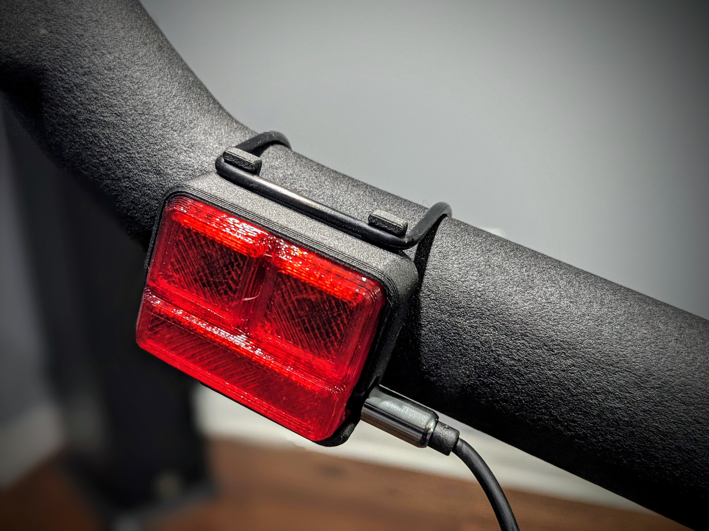
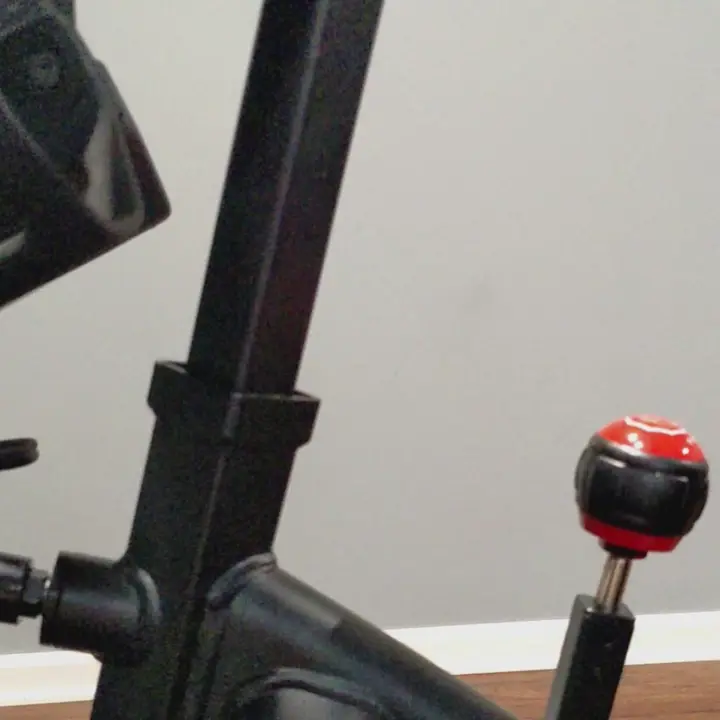
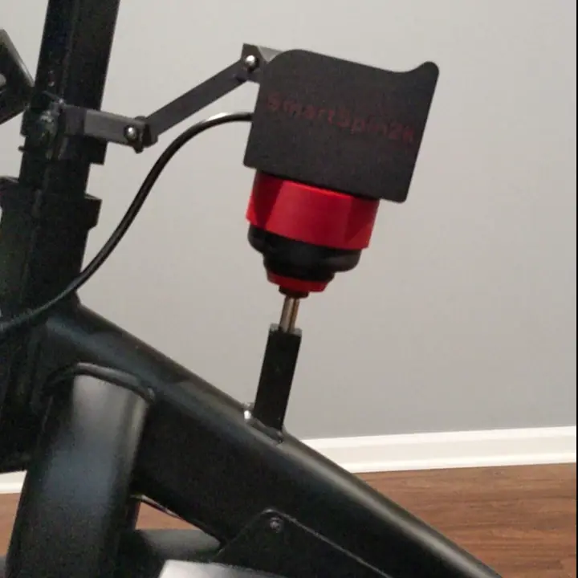

# Installation Guide
{: .no_toc }

Table of contents
{: .no_toc }
{: .text-delta }
- TOC
{:toc}
---

## Installation Video

## Installation Guide
1. Connect the power adapter and shifter to your breakout cable as pictured below.  Peloton Bike owners will also want to connect the Y splitter to their 
breakout cable now.  
    
1. If using a wired shifter, mount it onto your bike and connect the headphone connector for the shifter to the breakout cable.
    
1. Use a 30mm bolt and hex nut to install the arm to the SmartSpin2k body.
1. Install another 30mm bolt and hex nut onto the bike mount.  Attach the bike mount to the front tube of your bike using a cable tie.
    
1. Place SmartSpin2k onto your bike and snap arm onto bike mount.

1. Connect cable from SmartSpin2k to breakout cable on bike.  There are arrows on the cable indicating the correct orientation for the connection. You can connect and disconnect SmartSpin2k from this connector between rides.
    

{: .red }
Peloton bike owners have a few extra steps.  Proceed with [wiring and setup instructions](peloton).

{: .highlight }
If you are using a Bluetooth-enabled bike, power meter, or have a Peloton Bike+, you are [ready to ride](first-ride). 