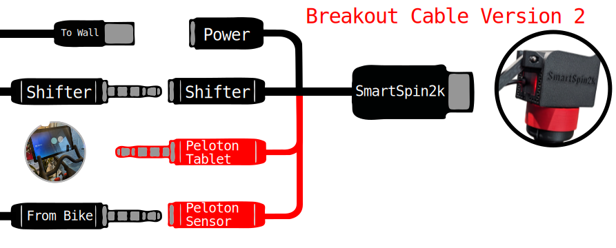
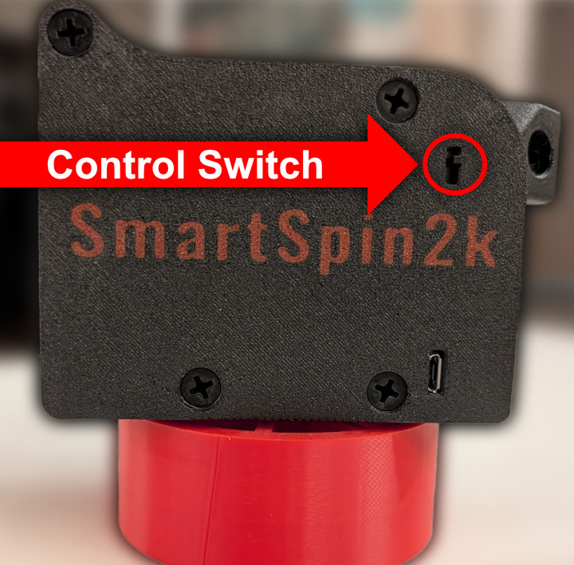

# Installation Guide
{: .no_toc }

Table of contents
{: .no_toc }
{: .text-delta }
- TOC
{:toc}
---

## Installation Video

---

## Hardware Installation
1. Using some O-Rings, mount the shifter onto your bike's handlebar.
    
1. Use a 30mm bolt and hex nut to install the arm to the SmartSpin2k body.
1. Install another 30mm bolt and hex nut onto the bike mount.  Attach the bike mount to the front tube of your bike using a cable tie, velcro straps, or o-rings.
    
1. Place the SmartSpin2k onto your bike, and snap the arm onto the bike mount.

--- 

## Wiring Installation
As of December, 2024, we have migrated to a new cable design for the SmartSpin2k.  This is a minor improvement over the previous design and the wires are clearly labeled for ease of use.  

1. Identify your cable below and follow the appropriate installation instructions
    * The V1 breakout cable shipped with a 3.5mm Y cable and an aux cord for peloton and for the shifter.  The breakout cable will have three connectors for power, shifter, and Peloton, as pictured below
    
    * The V2 breakout cable will have four connectors for power, shifter, Peloton Tablet, and Peloton Sensor, as pictured below:
    
    
    {: .red }
    Peloton Bike owners should continue with the Peloton [wiring and setup instructions](peloton).
    Bike+ requires a power meter.  Proceed with the wiring instructions below.

2. Connect the power adapter and shifter to your breakout cable as pictured above.

1. Connect the SmartSpin2k cable to the breakout cable.  Notice the arrows on the cables indicating the correct orientation for connection. If preferred, you can disconnect the cables between rides.
    

{: .highlight }
If you're using a Bluetooth-enabled bike, power meter, or have a Peloton Bike+, you're [ready to ride](first-ride)!

## The SmartSpin2k Control Switch

The SmartSpin2k hardware features a physical toggle switch. For most users, this switch is inactive and does not need to be adjusted.

### Does this apply to me?
* **Peloton Bike (Standard/Original): YES.** The switch is critical for your setup when using the wired configuration.  Learn more on our page for the [Peloton Bike](peloton)
* **Peloton Bike+: NO.** This bike uses wireless data (via [Grupetto](https://www.youtube.com/watch?v=a5DLBiieFqk) or power meter pedals). The switch has no effect on your ride. Proceed to your [first ride](first-ride)
* **Any Other Bike: NO.** If you connect via Bluetooth or an external power meter, the switch is not used.  Proceed to your [first ride](first-ride)
