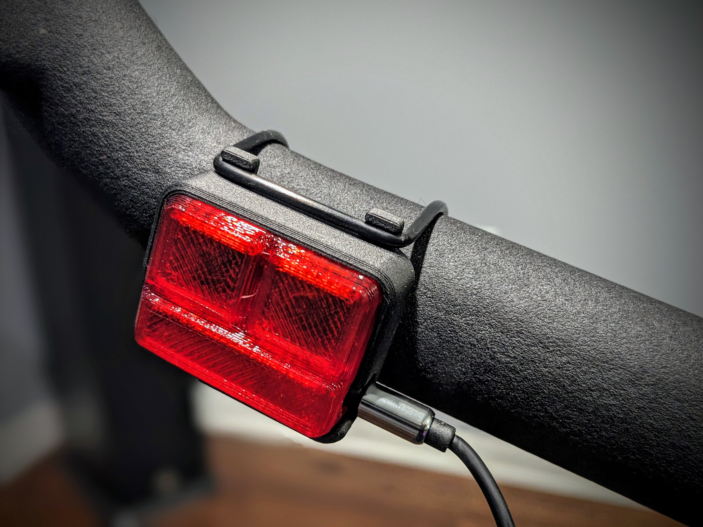
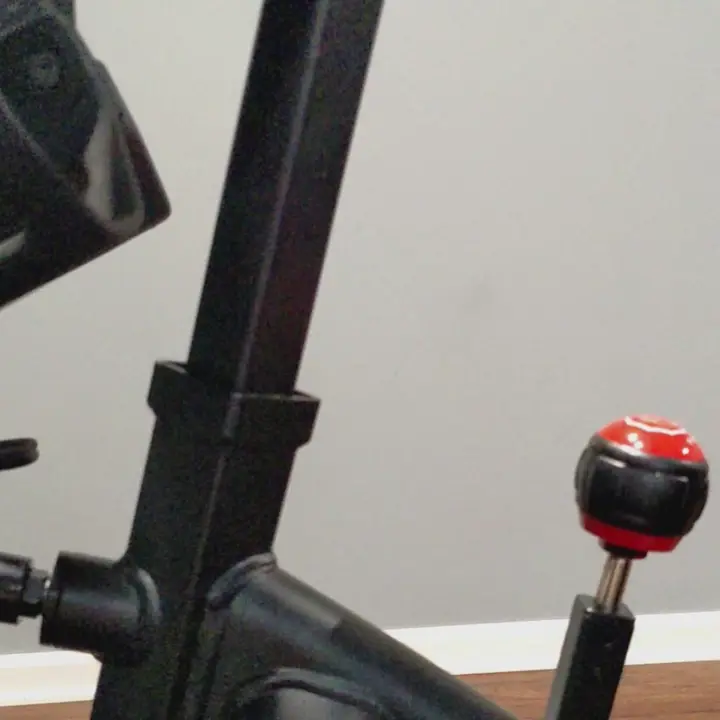
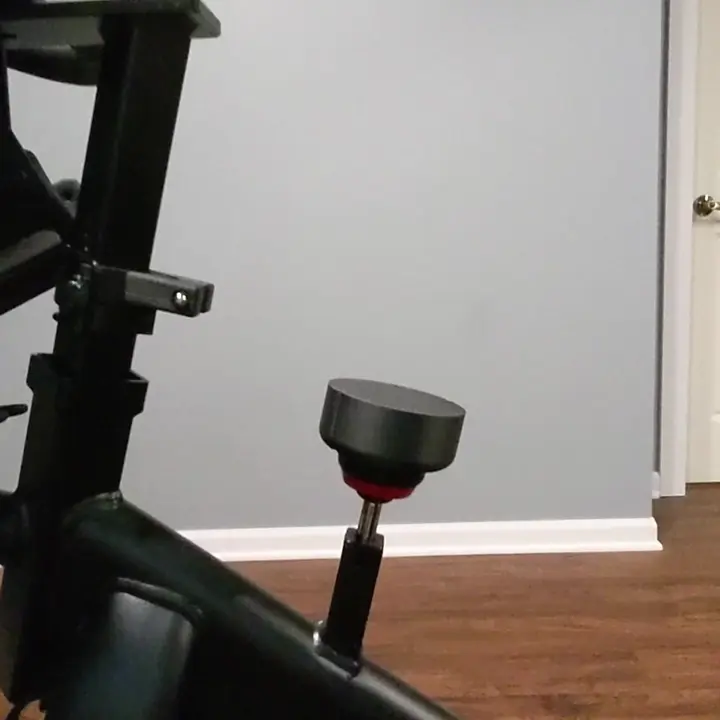
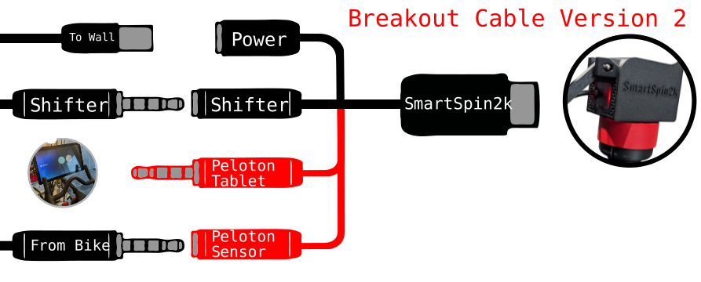
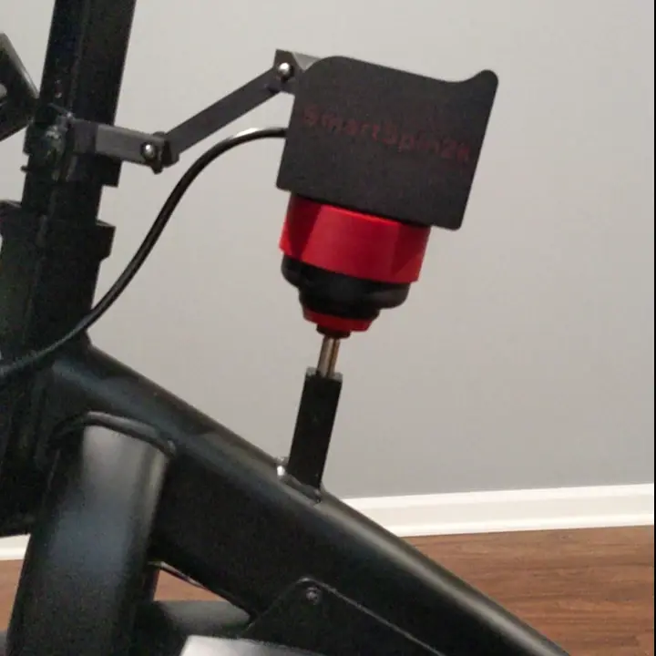
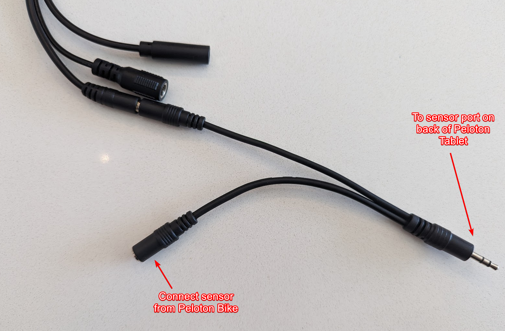
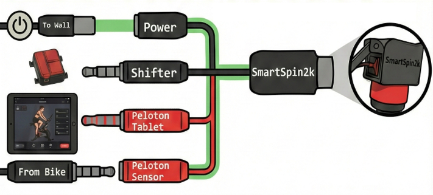
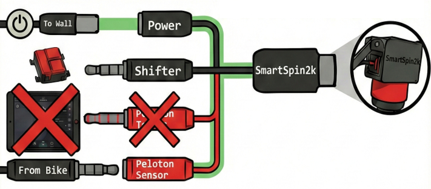
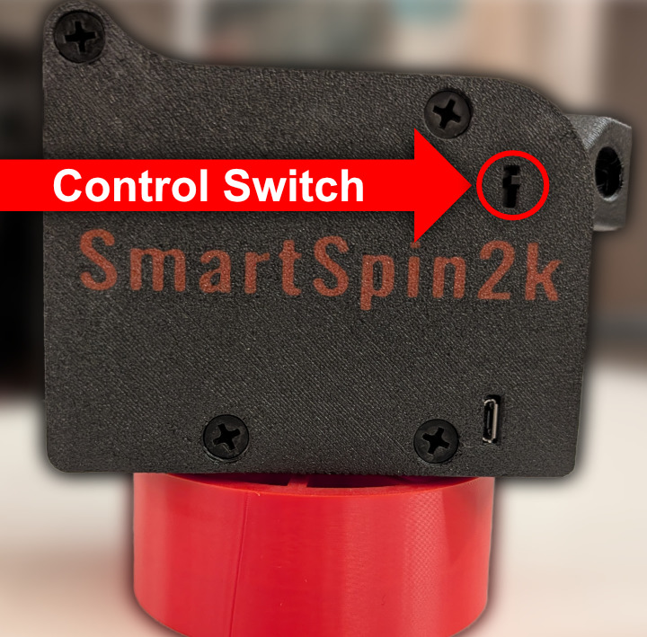

# Installation Guide
{: .no_toc }

Setup has two parts. First you mount the SmartSpin2k hardware on your bike — that's the same for everyone. Then you connect your wiring, which depends on the bike you ride.

Table of contents
{: .no_toc }
{: .text-delta }
- TOC
{:toc}
---

## Installation Video

---

## Step 1: Mount the Hardware

These mounting steps are the same for every bike. Do these first, then move on to wiring.

1. Using some O-Rings, mount the shifter onto your bike's handlebar.
    
1. Use a 30mm bolt and hex nut to install the arm to the SmartSpin2k body.
1. Install another 30mm bolt and hex nut onto the bike mount. Attach the bike mount to the front tube of your bike using a cable tie, velcro straps, or o-rings.
    
1. Place the SmartSpin2k onto your bike, and snap the arm onto the bike mount.
    

---

## Step 2: Connect Your SmartSpin2k

First, get familiar with your breakout cable. Then find your bike below and follow the matching wiring section.

### Your breakout cable

The breakout cable has four connectors, each labeled on the wire:

- **Power** — connects to the included power adapter.
- **Shifter** — connects to the wired shifter you mounted on your handlebar.
- **Peloton Tablet** — only used on the original Peloton Bike (in Tablet Mode).
- **Peloton Sensor** — only used on the original Peloton Bike.

Connect the breakout cable to the SmartSpin2k cable. The arrows on the connectors show the correct orientation. You can disconnect the cables between rides if you prefer.

### Most Spin Bikes
{: #wiring-spin-bikes }

If you ride a Schwinn IC4, Bowflex C6, NordicTrack, or another magnetic-resistance spin bike, your wiring is short:

1. Plug the **Power** connector into the included power adapter, and plug the adapter into the wall.
2. Plug the **Shifter** connector into the wired shifter on your handlebar.

That's the whole wiring step. The Peloton Tablet and Peloton Sensor connectors stay unused — leave them tucked out of the way.

If you've added a Bluetooth power meter to your bike, no extra wiring is needed on the SmartSpin2k side. The Companion App will pair with your power meter wirelessly.

When you're ready, head to the [spin bikes setup guide](spin-bikes) to pair your bike to the SmartSpin2k Companion App.

### Peloton Bike (original)
{: #wiring-peloton }

The original Peloton Bike connects to SmartSpin2k through a wired link to the bike's sensor cable. This is the wiring step:

1. Plug the **Power** connector into the included power adapter, and plug the adapter into the wall.
2. Plug the **Shifter** connector into the wired shifter on your handlebar.
3. Find the sensor cable on your Peloton Bike — the cable that normally runs between the bike's sensor and the back of the tablet. Disconnect it from the back of the tablet.
4. Plug the **Peloton Sensor** connector on your breakout cable into the bike's sensor cable.

   

5. Decide whether to plug in the **Peloton Tablet** connector:
   - **If you want to keep using the Peloton tablet** (for Peloton classes, Grupetto, or any other tablet app while you ride): plug the **Peloton Tablet** connector into the back of the Peloton tablet, where the sensor cable used to go.

     

   - **If you don't plan to use the Peloton tablet during your rides** (you ride from a phone, computer, or separate device): leave the **Peloton Tablet** connector unplugged.

     

When you're done wiring, head to the [Peloton setup guide](peloton) to pick your operating mode and finish setup.

### Peloton Bike+
{: #wiring-bike-plus }

{: .red }
**Do not plug SmartSpin2k into your Bike+.** The Bike+ has no compatible wired connection. The headphone jack on the bike looks like it should work — it isn't. SmartSpin2k will not work correctly if the Peloton Sensor cable is plugged into a headphone connector. Leave the **Peloton Tablet** and **Peloton Sensor** connectors on your breakout cable unused.

Your wiring is just power:

1. Plug the **Power** connector into the included power adapter, and plug the adapter into the wall.
2. Plug the **Shifter** connector into the wired shifter on your handlebar.

Bike+ owners get their power and cadence data wirelessly. You'll need either [Grupetto](https://www.youtube.com/watch?v=a5DLBiieFqk) (a free app you sideload onto the bike's tablet) or a Bluetooth power meter. Either one works — pick whichever fits your setup.

When you're ready, head to the [Bike+ setup guide](bike-plus) to pair Grupetto or your power meter.

---

## Step 3: The Switch on the Side

There's a small toggle switch on the side of the SmartSpin2k body. We get questions about it all the time, so it's worth a moment up front.

For most users, this switch does nothing and you can ignore it. It only matters if you have an original Peloton Bike.

### Does this apply to me?

- **Most Spin Bikes: NO.** The switch has no effect when you connect over Bluetooth or with a power meter. Leave it where it is.
- **Peloton Bike (original): YES.** Set the switch to match your wiring. Up (Tablet Mode) if the Peloton Tablet connector is plugged into the back of the tablet, down (Headless Mode) if it isn't. The [Peloton setup guide](peloton) walks through which mode to pick.
- **Peloton Bike+: NO.** Bike+ uses wireless data only, so the switch has no effect on your ride.
