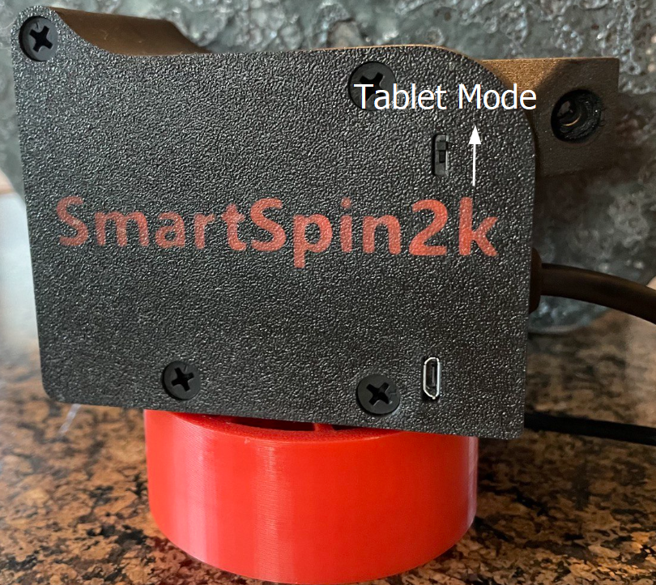
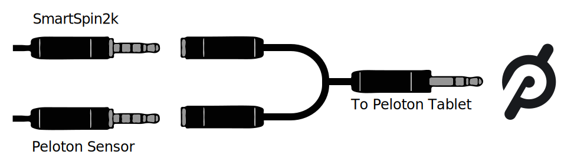
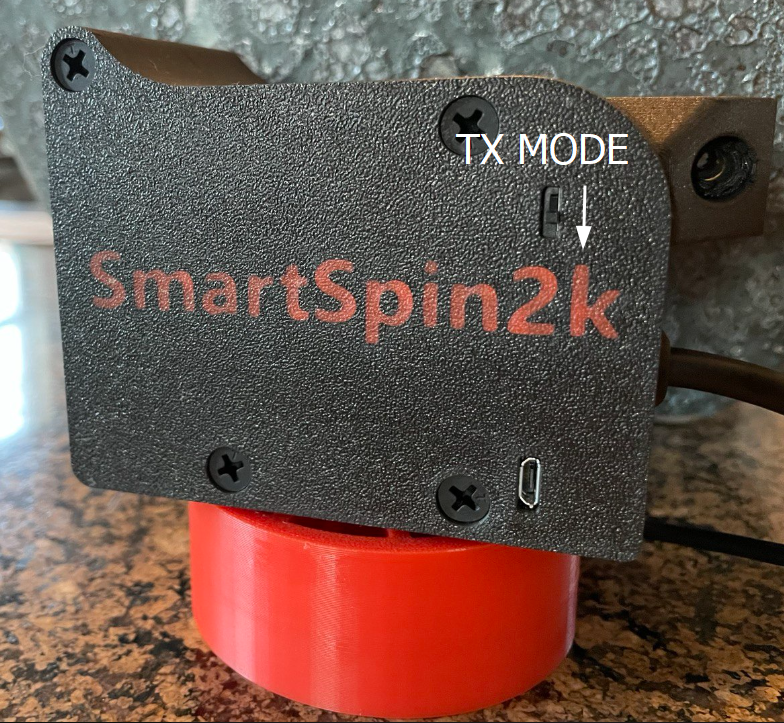

# Peloton Setup for SmartSpin2k
{: .no_toc }

Use this guide to choose and configure the operating mode for your Peloton bike with the SmartSpin2k device. Select a mode based on how you wish to interact with your Peloton and SmartSpin2k.

Table of Contents
{: .no_toc }
{: .text-delta }
- TOC
{:toc}
---

## Choosing Your Operating Mode
Peloton Bike users have three options for using SmartSpin2k, each offering unique features and setup requirements:
- **Tablet Mode**: Ideal for those who use Peloton's digital services directly on the bike's tablet.
- **Headless Mode**: Suitable for users who prefer using third-party apps and do not use Peloton's digital services.
- **Bluetooth Mode**:  For users with power meter pedals.

Select the mode that aligns with your usage preferences, and follow the setup instructions below for your chosen mode.

{: .caution }
Peloton Bike+ owners need a power meter for compatibility with SmartSpin2k.

### Tablet Mode Setup

Expand to view Tablet Mode setup instructions

1. **Set SmartSpin2k to Tablet Mode**: Flip the switch on the side of your SmartSpin2k device up, towards the tablet.
   
2. **Connect Y Splitter**: Attach the 3.5mm Y splitter to your bike as shown below.
   
3. **Power On**: Ensure the Peloton Bike Tablet is turned on and logged into your account.
4. **Select Workout**: Start a workout or free ride in the Peloton app to activate the bike.
5. **Connect to Apps**: Use the following guide to connect SmartSpin2k with apps like Zwift.
   [Riding Zwift with SmartSpin2k](first-ride#pair-smartspin2k-to-your-training-app)

### Headless Mode Setup

Expand to view Headless Mode setup instructions

1. **Switch to Headless Mode**: Flip the switch on the side of your SmartSpin2k device down, towards the bike or ground.
   
2. **Connect Y Splitter**: Attach the 3.5mm Y splitter to your bike and SmartSpin2k, leaving the male end of the cable disconnected as shown below.
3. **Connect to Apps**: Use the following guide to connect SmartSpin2k with apps like Zwift.
   [Riding Zwift with SmartSpin2k](first-ride#pair-smartspin2k-to-your-training-app)
{: .caution }
> **Important Reminder**  
> Remember to switch back to [Tablet Mode](#tablet-mode) if you want to use any Peloton services after using this mode.

### Bluetooth Setup
Follow the [First Ride Instructions](first-ride) if you are using a bluetooth power meter with your Peloton Bike or Bike+.