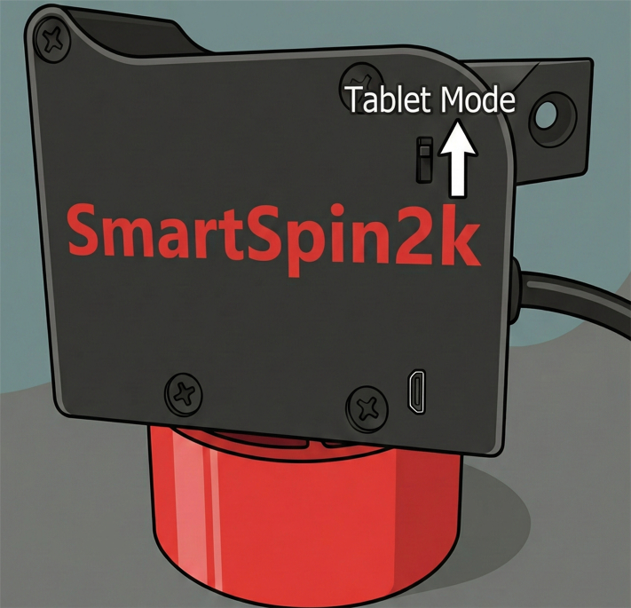
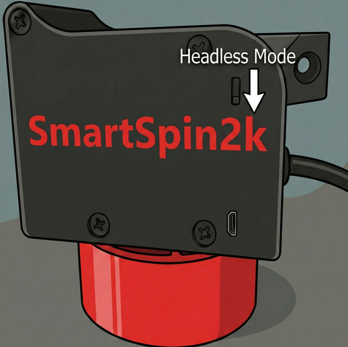

# Peloton Bike Setup
{: .no_toc }

Your hardware is mounted and your wiring is connected. (If not, [start with installation](installation#wiring-peloton).) Now you'll pick the operating mode that fits how you ride, set the side switch to match, and verify the setup in the SmartSpin2k Companion App.

Table of contents
{: .no_toc }
{: .text-delta }
- TOC
{:toc}

---

## Instructional Video

---

## Step 1: Pick your operating mode

Peloton Bike (original) users have two operating modes. The choice depends on what you want the Peloton tablet to do during your rides.

In Tablet Mode, the Peloton tablet stays connected and usable, so you can still take Peloton classes or use Grupetto. In Headless Mode, the tablet is disconnected and you ride from a phone, computer, or other device instead.




**Pick this if you want to keep using the Peloton tablet during rides** — for Peloton classes, Grupetto, browsing, or any other tablet app while you ride.

1. Confirm the Peloton Tablet connector on your breakout cable is plugged into the back of the Peloton tablet. (See the [Peloton wiring section](installation#wiring-peloton) if you need to revisit this.)
2. Set the side switch on your SmartSpin2k **up**, toward the tablet.
   
3. Power on the Peloton tablet and log in.
4. Start a workout or free ride on the Peloton. The bike's sensor only broadcasts data once a ride is active, so this step is required before the Companion App will see power and cadence.




**Pick this if you don't use the Peloton tablet during rides** — you ride from a phone, computer, or separate device.

1. Confirm the Peloton Tablet connector on your breakout cable is **not** plugged into the tablet.
2. Set the side switch on your SmartSpin2k **down**, toward the bike or ground.
   

{: .caution }
**Going back to Peloton classes later?** Switch back to Tablet Mode — move the side switch up and reconnect the Peloton Tablet connector — before using any Peloton services.




---

## Step 2: Connect the Companion App to your SmartSpin2k

1. Open the SmartSpin2k Companion App on your phone.
2. Scan for nearby devices.
3. Tap your SmartSpin2k when it appears in the list. The app shows a connected state once pairing succeeds.

## Step 3: Confirm the data is flowing

Get on the bike and pedal for a few seconds. Power and cadence should appear in the Companion App.

On the Peloton Bike (original), this data comes from the bike's own sensor through the wired breakout cable connection — there's no separate power meter to pair. If you're in Tablet Mode and aren't seeing data, make sure a workout or free ride is running on the Peloton tablet (the bike's sensor only broadcasts during an active ride).

## Step 4: Test the shifter

Use the on-screen shifter in the Companion App, then try the physical shifter on the bike. You should see the gear change in the app and feel the resistance change on the bike.

---

{: .highlight }
**That's the setup.** Most users go on to a cycling app like Zwift — that's the next page.

## Next: pair to your cycling app

Continue to the [first ride guide](first-ride) to pair your SmartSpin2k to Zwift or another cycling app.

## Riding with a power meter instead

If you've added a Bluetooth power meter to your Peloton instead of using the wired sensor connection, follow the [Most Spin Bikes setup](spin-bikes) — that flow covers Bluetooth power source pairing.
