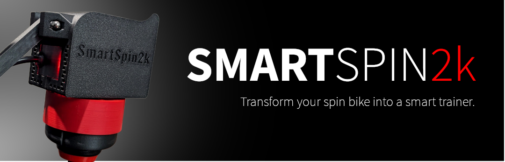

test push

SmartSpin2k is an open-source device that allows you to turn any spin bike into a smart trainer. With SmartSpin2k, you can connect your spin bike to Zwift, TrainerRoad, or other popular training apps. This allows you to control your exercise bike's resistance automatically, track your performance, and compete with other riders online.

All of the current smart trainer modes are supported, including ERG mode!

Most spin bikes are compatible. For connectivity, SmartSpin2k requires some type of power and cadence information from your bike. Most of the time that's from wireless data, except with the regular Peloton bike (not the bike+), we use a wired connection. In general, if your bike connects to Zwift, Rouvy or another training app, you'll be able to use it directly. If not, you'll need a power meter such as the Tempo, Assomia uno/duo or Garmin pedals.