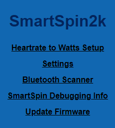
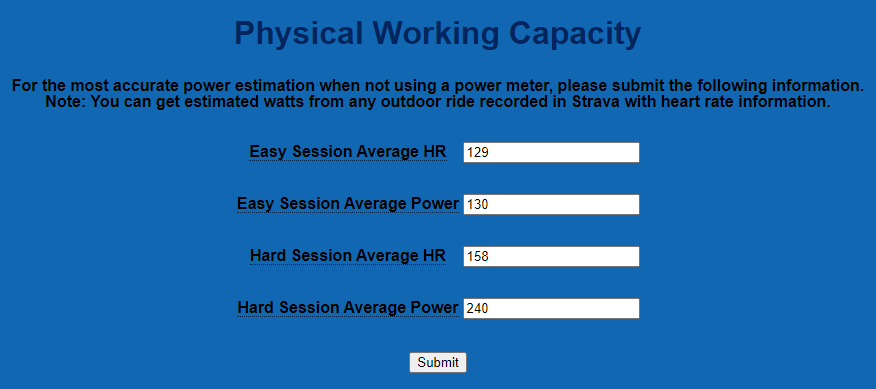

# I Don't Have a Power Meter, But I Still Want to Use SmartSpin2k.

{: .caution }
This functionality is experimental and best used if you don't have alternative solutions to a power meter.  We suggest seeing if your bike is supported by [Qdomyos-Zwift](https://www.qzfitness.com/) before using heart rate derived power.

SmartSpin2k has a method to convert your heart rate into estimated power based on the Brian Mac's spreadsheet. https://www.brianmac.co.uk/pwc170.htm

Access the setup page by clicking on the top link.

Note that anytime the SmartSpin2k does not sense power information from another source, it will revert to showing power estimated from the Heart Rate to Watts Setup algorithm.

In summary, power output follows heart rate in a linear fashion. This is dependent on user fitness, and to get the best information from SmartSpin2k, perform the following.

The most effective measurement will occur with two 1-hour straight-line rides with minimal wind and a power meter. One "easy" ride and one "hard" ride. Average heart rate and average power is then entered into the "easy" ride fields. Complete the same with a "hard" ride.

A simpler method is available for users of Strava. Again, find a ride which you consider "easy" and view the average heart rate and average power. Enter those into the fields in the SmartSpin2k. Find the same average heart rate and power from a ride you consider "hard" and enter those into the hard fields.

