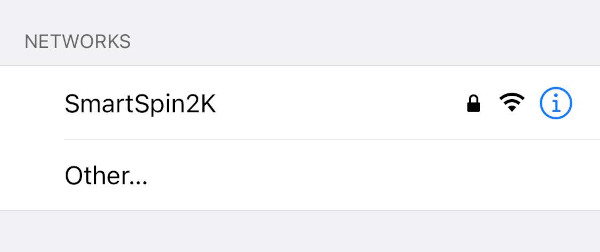
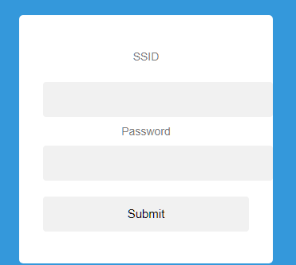
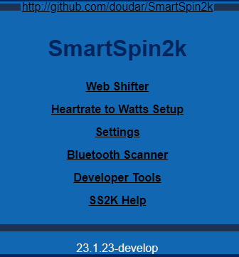
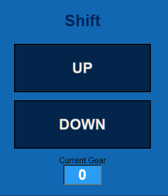
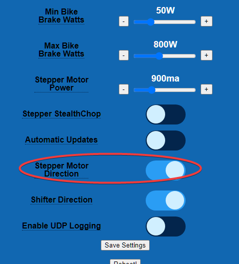
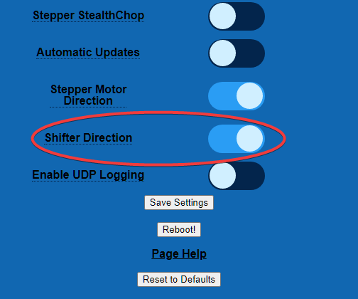

---

  

    Table of contents
  

  {: .text-delta }
- TOC
{:toc}

---
# Quickstart!
If you use a BLE bike (or power meter) and BLE HR monitor, and there are no other BLE Power/HR devices near you (i.e. you don't live in an apartment), you will be able to just get on and ride.  Before you begin, make sure you have disconnected any 3rd party apps that may be connected to your sensors. Then:

1. Turn on the SmartSpin2k. 
2. Turn on your HR monitor and power meter.
3. Open your preferred cycling app (Zwift, Fulgaz, Trainer Road, etc...)
4. Pair the SmartSpin2k in those apps.

And then ride...Seriously, that's it. 

If you'd like to make changes to shift steps or other advanced settings, then you can continue with the steps below. 

# Accessing Advanced Settings
## Using the Mobile App

## Configure Wifi
* On initial boot the SmartSpin2k will create its own Wifi network Access Point with the SSID of “SmartSpin2k”.  If asked for a password, use "password" without the quotes

* The configuration page will automatically load on mobile. If you are not taken to the page or if you are using a computer, the configuration page can be found at <http://SmartSpin2K.local/>

* Enter your local WiFi network information with SSID and password. Please note:  The SmartSpin2K requires a 2.4ghz wifi connection.  Please ensure you use the correct wifi network if you have separate SSID's for 5ghz and 2.4ghz..
* Click Submit and wait for the page to refresh.
* Click Reboot.
* SmartSpin2K will automatically update if the Wifi Network you paired the device to is connected to the internet.  The blue LED will flash quickly while this process occurs.  This may take up to 3 minutes.  
* Once the blue LED is flashing slowly, make sure your phone or computer are connected to your home wifi network.
* Navigate to <http://SmartSpin2K.local/> to confirm that you can access the configuration pages of SmartSpin2K.  You should see a page like this:

## Configure Motor Direction
You may need to flip your motor's orientation depending on how it is wired.  This can be done directly in the SmartSpin2K user interface.  

* Mount your SmartSpin2K on your bike alternatively, place it on a table with the knob cup facing up towards the ceiling.
* Navigate to <http://SmartSpin2K.local/> if you are not there already.
* Click on the Web Shifter link.  **Do not use the wired shifter for this step**
* Click the "Up" or "Down" button and observe the direction the knob turns.  

* If the knob turned in the direction you expect, great!  You are good to go to the next section.  If not, proceed to the next step:
* Click back on your browser or navigate to <http://SmartSpin2K.local/>
* Select Settings
* Scroll down to Stepper Motor Direction and toggle the button.

* Click Save Settings
* Repeat these steps to test shifting on the web shifter again.  The motor should now be turning in the correct direction.

## Configure Shifter Direction
You might need to adjust the shifter direction.  These steps will help you test and change the direction if necessary:

* Connect the shifter to your SmartSpin2K if is not already connected.
* Press the up or down button on your shifter.  Observe the direction the knob turns
* If the knob turned in the direction you expect, you're ready to configure bluetooth! If not, proceed to the next step:
* Navigate to <http://SmartSpin2K.local/> 
* Click on Settings
* Scroll down to Shifter Direction and toggle the button

* Click Save Settings
* Test your shifter again and confirm the motor turns in the correct direction.

You are now ready to pair the SmartSpin2K to bluetooth.  [Follow along here for instructions](https://github.com/doudar/SmartSpin2k/wiki/Pairing-Bluetooth-Sensors)