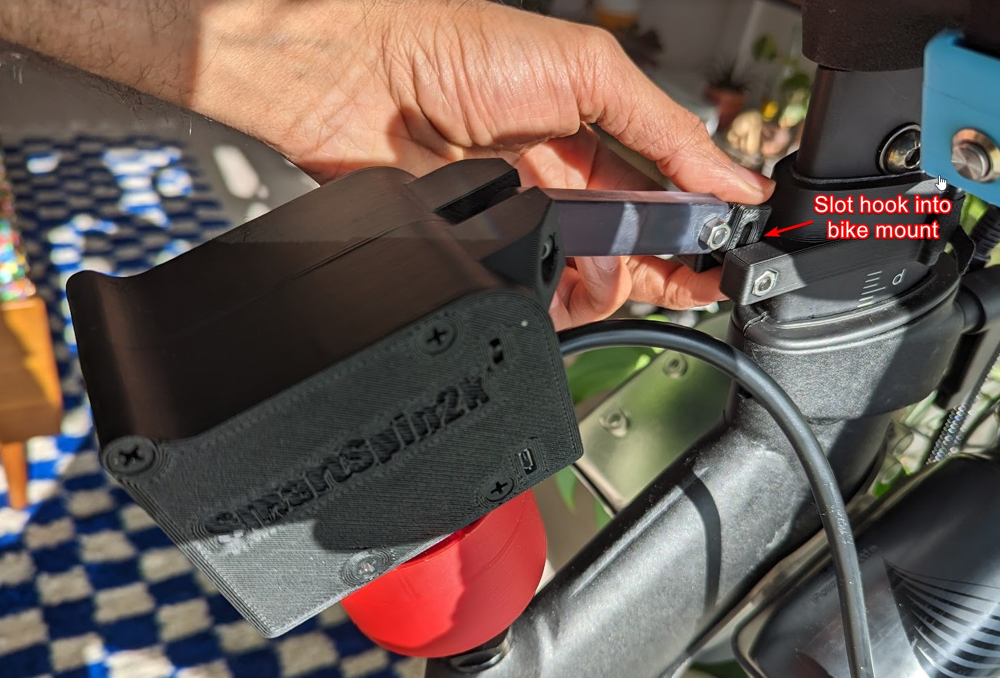
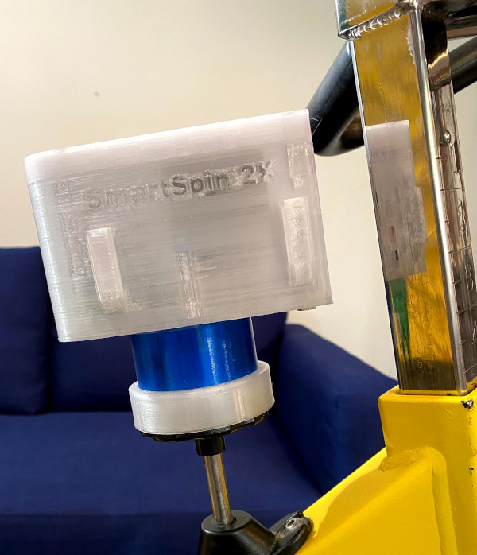
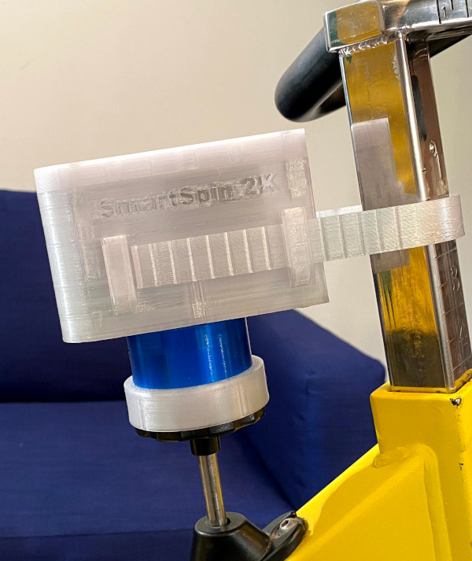

---

  

    Table of contents
  

  {: .text-delta }
- TOC
{:toc}

---
# Version 3
**Watch the video or read the instructions below**

1. Use some Zip ties to mount the breakout cable to your bike.  You will want this to be in reach of the power cable and shifter cable.  

1. If using a wired shifter, mount it onto your bike and connect the headphone connector for the shifter to the breakout cable.
1. Peloton users only: connect one of the female ends of as 2x Female to 1x Male 3.5mm Headphone Y splitter to the breakout cable.  Connect the other female end of the Y cable to the bike's sensor cable.  Finally, if using [Tablet Mode](https://github.com/doudar/SmartSpin2k/wiki/Peloton-Setup#tablet-mode), connect the Male connector the the rear of your Peloton Bike's tablet

1. Connect the power cable to the DC Power connector on the breakout cable
1. Use a 30mm Bolt and hex nut to install the arm to the SmartSpin2K body
1. Install another 30mm bolt and hex nut onto the bike mount.  Attach the bike mount to the front tube of your bike using a cable tie

1. Place SmartSpin2K onto your bike and snap arm onto bike mount

1. Connect cable from SmartSpin2K to Breakout cable on bike.  There are arrows on the cable indicating the correct orientation for the connection. You can connect and disconnect SmartSpin2K from this connector between rides.

# Version 1 & 2

Watch an install video for version 1. Version 2 is very similar but the "mounting strap" only goes on one side of the head tube and then you can use zip ties or Velcro to secure it to your head tube. 
 

Have an outlet or extension cord in order to safely route the power cable to the SmartSpin2k.
* It is helpful to make sure your resistance knob rotates freely and is in a fairly easy to pedal setting prior to setup.
* Place the SmartSpin2k on the resistance knob of your spin bike, gently press down so that the SmartSpin2k sits flush on the resistance knob.
 
* 
* Wrap the plastic head tube strap around your spin bike head tube, and insert the ends into your SmartSpin2k.
* 
* Plug in the power cord to your SmartSpin2k. 
* Plug the shifter buttons into the SmartSpin2k.
* 
* Press one of the buttons and observe which direction the SmartSpin2k rotates the resistance knob. Strap the shifters to your handlebar in a location most comfortable for you to press while riding. Most of us run the “increase resistance” shift button on our right side, and “decrease resistance” shift button on the left side.

Test the shift buttons to make sure the SmartSpin2k can rotate the resistance knob with a few shifts in each direction. If the SmartSpin2k is encountering difficulty rotating the knob, it may be that your resistance knob assembly requires some maintenance. Cleaning and lubricating should solve this. There is also an option in the Settings page which can increase the torque of the SmartSpin2k motor as different spin bikes may require different torque power.

Now move on to Pairing Bluetooth Sensors! If you prefer to ride without connecting to any smart trainer service, you can now use the SmartSpin2k and control resistance with the shift buttons.

Click on this image to be redirected to a YouTube installation video

