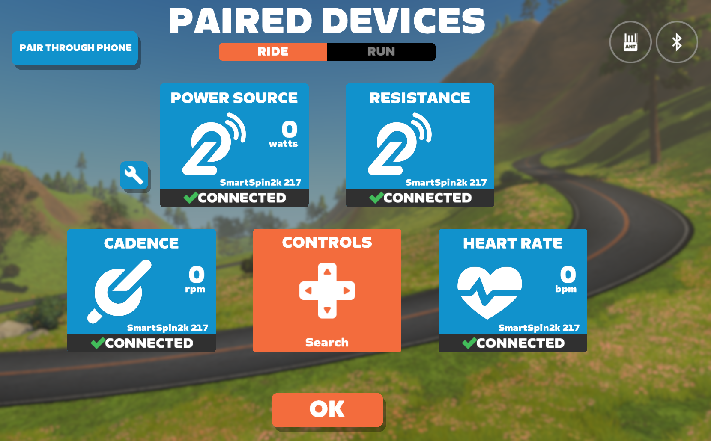

# How to Pair SmartSpin2k to Your Training App

Once you have completed your Bluetooth sensor pairing to the SmartSpin2k, you are ready to connect to your training app. As mentioned previously, your best performance will likely result in pairing all sensors to the SmartSpin2k, followed by pairing the SmartSpin2k to your training app.  

{: .highlight }
While the following instructions are for Zwift, most training apps behave the same way.  For a full list of compatible apps, check out the [Compatibility](compatibility) page. 

1. Log into Zwift and make sure your device has Bluetooth switched on.
1. Click Power Source and select SmartSpin2k.
1. Wait 5 seconds.
1. Click Resistance and select SmartSpin2k.
1. Click Cadence and select SmartSpin2k.
1. If you have a heart rate monitor paired to SmartSpin2k, click Heart Rate and select SmartSpin2k.

{: .caution }
If there are any issues, usually a “scan and reconnect” by holding the shifter buttons simultaneously will resolve any problems.

