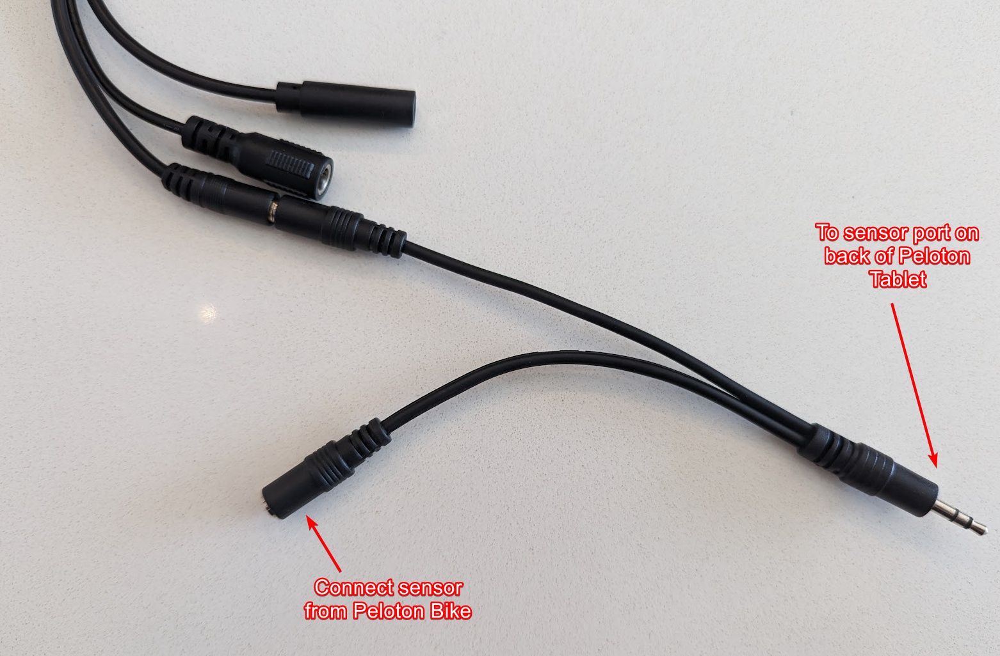
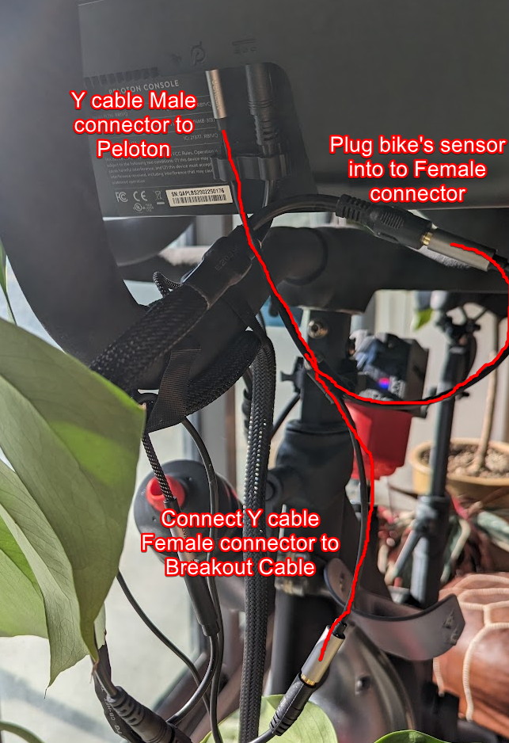
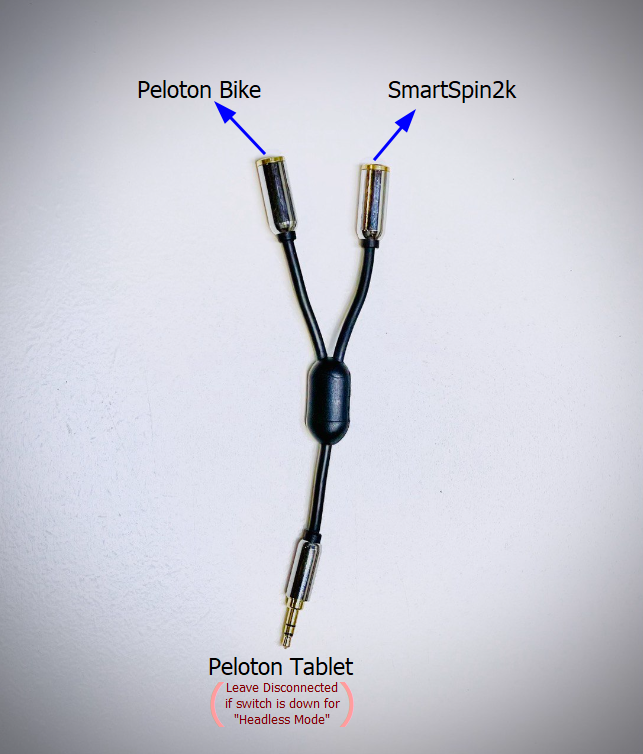

---

  

    Table of contents
  

  {: .text-delta }
- TOC
{:toc}

---
# Using this guide
This is for the Peloton bike with The newest SmartSpin2k. The Peloton Bike+ requires a dedicated power meter to be paired via BLE. 

# Wiring instructions for Peloton Bike owners
1. Connect one of the female ends of as 2x Female to 1x Male 3.5mm Headphone Y splitter to the breakout cable.  Connect the other female end of the Y cable to the bike's sensor cable.  See wiring diagram below

# Peloton operating modes
There are **two modes** of operation with Peloton, controlled by a switch on the side of the SmartSpin2K. The mode of operation you choose depends entirely on your use case. Setup and start procedures differ slightly for each mode.

* **Tablet mode** - Peloton tablet controls communications with the bike. 
* **Headless mode** - SmartSpin2k controls communications with the bike. 

* **For best performance, select "none" as the power meter in the SmartSpin2k Bluetooth scanner settings. 

## Tablet Mode

Tablet mode is what most users work with. This mode works nicely within the Peloton ecosystem. The Peloton tablet will request data from the bike and the SmartSpin2k will listen to that communication passively. **You will need to be in a workout or free ride in the Peloton app** in order for SmartSpin2k to work in this mode.  

To enable Tablet mode, flip the switch on the side of your device up, to face towards the tablet. 

Ensure the male end of the 3.5mm y-splitter is connected to your tablet. Connect the male 3.5mm connectors from the breakout cable and from the bike's sensor to the other two ends of the y splitter

Start a free ride in Peloton.

[Connect to Zwift or other apps](https://github.com/doudar/SmartSpin2k/wiki/Riding-Zwift-with-SmartSpin2k)

## Headless Mode

Headless mode aka TX mode does not require a free ride to be enabled in the Peloton tablet. This enables many possibilities for users:  You can run your own apps directly on the tablet (such as moonlight - this may void your warranty), or you can simply turn the tablet off.  This mode is also useful if your tablet is damaged since SmartSpin2k can present your ride data to any app of your choice.

To enable headless mode, flip the switch on the side of your device to face down towards the bike/ground.

**Disconnect the male end of the 3.5mm y-splitter from the tablet** and leave the 3.5mm cable from the SmartSpin2k breakout cable connected through the y cable to the bike sensor cable. 

**Note**:  It has been reported that **not all Peloton Tablets will power on in this mode** (with the data cable disconnected from the tablet.)  A loopback cable can be used to force operation. One of these can be created by using a 2x male to 1x female 3.5mm stereo headphone splitter and connecting one of the male ends into the female end. By looping one of the male ends of this cable into the female end and connecting the remaining male end to the bike's tablet, you can trick the bike into thinking the sensor cable is connected.

[Connect to Zwift or other apps](https://github.com/doudar/SmartSpin2k/wiki/Riding-Zwift-with-SmartSpin2k)

Note:  You must reconnect the y-splitter to the Peloton tablet and flip the switch up if using the Peloton service for your rides.

# Peloton Automatic Resistance
Through the use of Qdomyos-Zwift, it's possible to have automatic resistance for your instructor-guided rides in Peloton.  For this to work, you will need to use Tablet Mode and a secondary Android/IOS device running Qdomyos-Zwift.  In the near future, it may be possible to run QZ directly off the Peloton tablet. This isn't supported directly by SmartSpin2k - if you'd like to use Qdomyos-Zwift, please reach out to members of their community for help and configuration. 

[Learn more here](https://www.qzfitness.com/)
