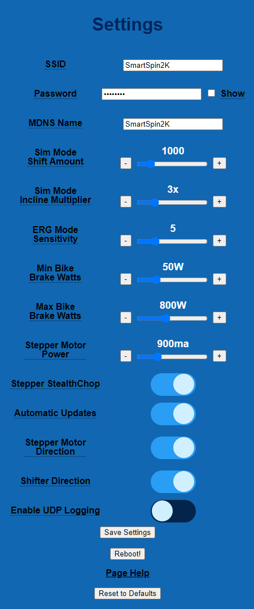

# What do all these settings mean?
There are a number of settings available to customize the behavior of your SmartSpin2k to optimize the feel and realism with your Zwift ride. These settings will vary from bike to bike. 

All settings, aside from Automatic Updates are saved when the Submit button is clicked, and occur immediately.  You can adjust these settings mid ride from your browser while you are getting it dialed in.

* **Sim Mode Shift Amount**: This setting controls how much each click of the shifter turns the dial.  The ideal setting is different for each bike and person.  Try aiming for a +/- 30 watt change when you click the shifter.  Higher values will turn the knob further.  

* **Sim Mode Incline Multiplier** This setting affects how much you will feel the impact of hills in sim mode rides.  The value is adjustable from 1 to 10. Pick the setting which feels most realistic to you.  Higher values will make hills feel steeper while lower values will flatten out the hills.  Try starting at 5 and going up and down from there.  Please note that Zwift has a default hill difficulty of 50%.  This cuts the impact of the Sim Mode Incline Multiplier in half.  For realistic results, you may need to adjust this setting in the app.  [Read more about Zwift Difficulty here](https://zwiftinsider.com/using-the-trainer-difficulty-setting-in-zwift/) 

* **ERG Mode Sensitivity** adjusts the aggressiveness of the erg.  This can be adjusted from 1 to 20.  Too low will cause the ERG to be slow at reaching the target wattage.  Too high will cause it to overshoot too far and miss the target in each direction before it settles.  5 is a good starting value.  A little bit of overshoot is okay if it settles on the target output quickly. 

* **Min Bike Brake Watts** This setting is the lower limit of watts your bike can absorb.  This is set to ensure that SmartSpin2K does not try to turn the knob below it's minimum limit.  Too low will crash the knob at the lowest setting your bike can achieve and cause problems later during your ride.  You can determine this value by pedaling at 90 RPM with the resistance somewhere above absolute zero on the knob.  1-2 turns from the lowest resistance is usually a good starting point.  On the Schwinn IC4, it's suggested to have the resistance at 10 (out of 100) for this test.  Take note of the watts at this resistance and cadence.  This is your minimum brake watts value.

* **Max Bike Brake Watts** This setting is the upper limit of watts your bike can absorb.  This is set to ensure that SmartSpin2K does not try to turn the knob past it's maximum limit.  This value will vary per bike, and some riders will not be able to achieve the maximum value their bike can support.  700-800 watts is a good setting to start with.  You can determine this value by pedaling at 90 RPM with the resistance as high as you can comfortably hold it and take note of the watts.  Depending on how close you are to the bike's maximum resistance, you can set this value higher or close to this number.

* **Stepper Power** is adjustable from 500 to 2000 in milliamps. Let heat be your guide! Ideally select the lowest setting which will turn your resistance knob. Magnetic resistance bikes like Peloton, Echelon and the Schwinn IC4 can easily operate with the setting around 800ma or lower.  Felt resistance bikes will need this set close to the max.  Too low of a setting will result in a choppy, under-powered rotation of the knob. Prior to increasing power beyond default, make sure your resistance knob is cleaned and lubricated to the manufacturer specifications from your spin bike.

* **Stepper Stealthchop** is just some electrical wizardry. Turn it on! It should optimize the power input/output of the stepper motor and make it nearly silent.  

* **Automatic Updates** will occur on reboot provided the SmartSpin2k is connected to an active internet connection.  

* **Shifter Direction** This setting controls the orientation of the motor and the direction it turns. Depending on how your motor is wired, this may need to be toggled.  Detailed instructions can be found [here](https://github.com/doudar/SmartSpin2k/wiki/Initial-Set-Up#configure-motor-direction)

* **Shifter Direction** This setting controls the direction the shifter turns the knob.  Depending on the orientation your shifters are mounted, you may need to toggle this.  Detailed instructions can be found [here](https://github.com/doudar/SmartSpin2k/wiki/Initial-Set-Up#configure-shifter-direction)

* **Enable UDP Logging** Leave this off unless you need access to logs from SS2K on your computer.  Instructions for accessing the UDP logs can be found [here](https://github.com/doudar/SmartSpin2k/wiki/Viewing-logs-via-UDP)